# Stenugnsbageriet Olof
Vi bakar surdegsbröd, bullar och kakor med smör, kärlek och öländskt lantvetemjöl.

## Kylutrymmen

Målet är att hålla koll på temperatur i kylutrymmen. Få reda på om dörren till kylutrymmet är öppet. Syftet är att veta om kylen är trasig eller har lämnats öppen och förhindra att matvaror blir dåliga.

### Välja nätverksteknologi

För det här projektet utforskas LORA Zigbee och WiFi som alternativ till att sckicka datan. Aspekter som är viktiga för bageriet är att det ska vara relativt billigt att köp in det som behövs. Det ska vara lätt att underhålla. Det ska hälst inte bövas att man sätter upp sig på några nya abonemang. För att lösningen ska funka krävs det också att signalen tar sig igenom de tjocka väggarna på kyl och frysutrymmet.

|Teknologi|Inledande kostnad|Kräver abonemang|Batteritid|Räckvidd innomhus|
|-|-|-|-|-|
|LORA|Hög|Inte nödvändigtvis|Väldigt lång |10-15 km|
|Zigbee|Låg|Inte nödvändigtvis|Lång|10-20 m|
|WiFi|Låg|Inte Utöver befintligt WiFi|Eventuellt kortare|upp till 50 m|

### Disskusion med Anna
Zigbee verkar kul för att man kan bygga vidare på det och inkludera saker som smarta lampor. Ikea känns som ett bra företag att köpa hubb ifrån. Wifi är värt att fortsätta undersöka som alternativ till Zigbee.

### Sensorförslag

Här följer 2 förslag på upsättningar av sensorer som kan köpas tillsammans.

#### Förslag 1
|Gateway| Sensor | antal | totalt pris |
|-|-|-|-|
||

#### Förslag 2
|Gateway| Sensor | antal | totalt pris |
|-|-|-|-|
||

### Förslag på dörrsensor som bara är larm
Denna typ av sensorer faller inte in under IOT, men det kanske är vad som bäst skulle fylla de behov som finns i bageriet. 
|Länk|pris|Batteritid|Användbar funktion|
|----|----|----------|------------------|
|[Fridggi](https://www.amazon.com/FRIDGGI-Freezer-Fridge-Delays-120sec/dp/B08B4H3LM8/ref=sr_1_1_sspa?keywords=Refrigerator%2BDoor%2BAlarm&qid=1698155334&sr=8-1-spons&sp_csd=d2lkZ2V0TmFtZT1zcF9hdGY&th=1)|22.64$|1 år|Olika typer av larm kan ställas in. Exempel 1: Mjukt larm efter en minut, påminnelse efter 2 minuter. Exempel 2: Ihållande larm efter 3 minuter.|
|[WSDCAM](https://www.amazon.com/Freezer-Seconds-Adjustable-Wireless-Refrigerator/dp/B08LMTF8GM/ref=sr_1_4?keywords=Refrigerator+Door+Alarm&qid=1698155334&sr=8-4)|22.99$|Ingen information|Larmar om dörren varit öppen i 3/15/30 eller 60 sekunder.|
|[Freezer Door Alarm](https://www.amazon.com/Freezer-Window-Reminder-Office-School/dp/B0BX9FZ6CB/ref=sr_1_6?keywords=Refrigerator%2BDoor%2BAlarm&qid=1698155334&sr=8-6&th=1)|16.99 $|ingen information|Kan ställas in att larma efter 30 sekunder. Påminelse var 20e sekund. Slutar efter en timme, eller när dörren stängs|

## Instruktioner

### Installation av appen Smart Life - Smart Living

Ladda ner appen

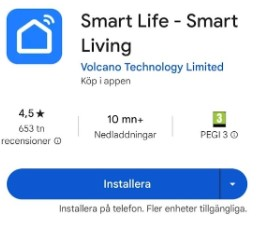

_______________________________
Skappa nytt konto

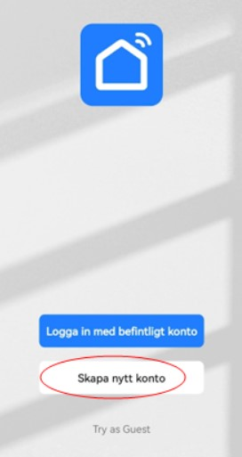

_______________________________
Skriv din e-post, godkänn villkoren och sedan välj Get Verification Code

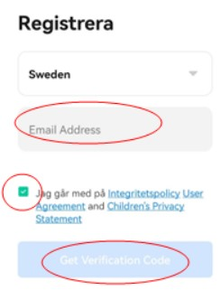

________________________________
Skriv in verifikationskod som du fått i din e-post.

________________________________
Skriv ett lösenord och välj sedan Klart.

_________________________________
Välj Go to App.

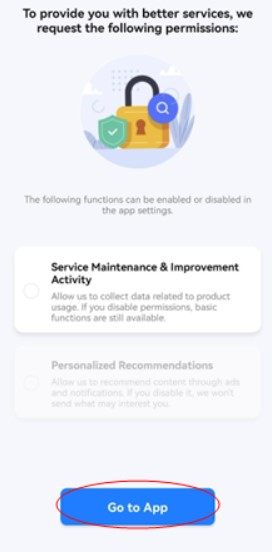

__________________________________
Appen är nu installerad.

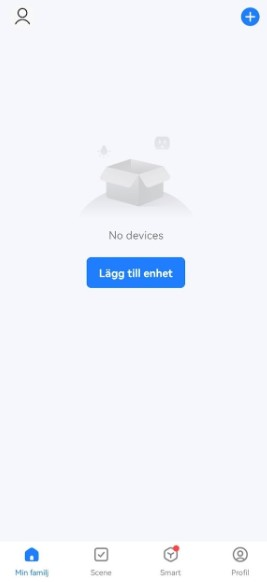

________________________________

### Installation av Gateway Cleverio SG100

Gateway Cleverio SG100

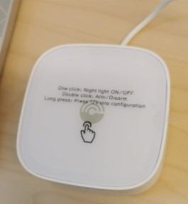

_______________________________
Öppna appen och välj Lägg till enhet.

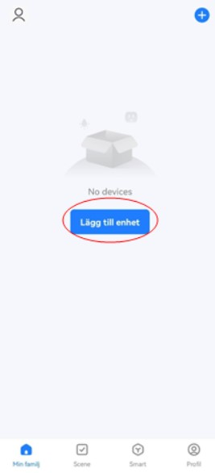

_______________________________
Välj Gateway Control I vänstra fliken.

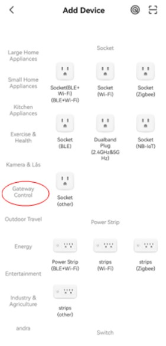

_______________________________
Välj Gateway (Zigbee). Samma som på bilden.

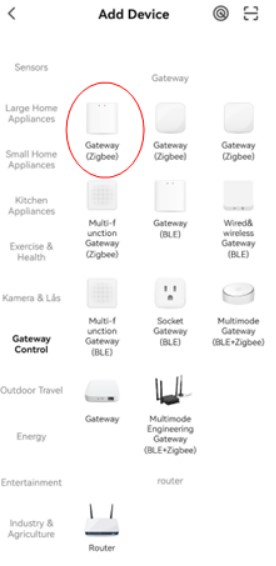

_______________________________
Koppla till Wi-Fi (Viktigt att det är 2.4 Ghz. Välj sedan Nästa.

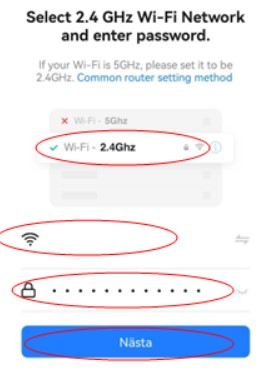

_______________________________
Välj Next.

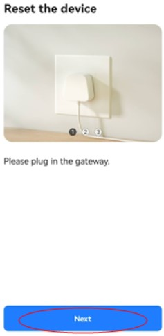

_______________________________
Håll RESET 5 sekunder och välj Next. 

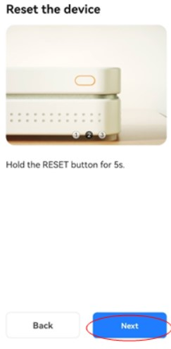
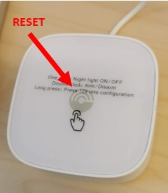

_______________________________
Välj Blink Quickly eller Blink Slowly.

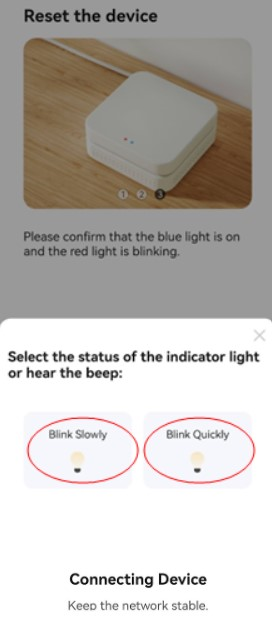

_______________________________
Vänta tills enheten hittats.

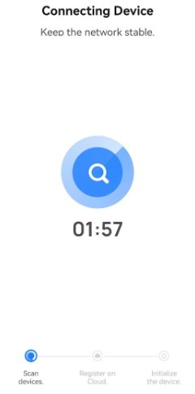

_______________________________
Enheten är nu hittad. Välj Klart.

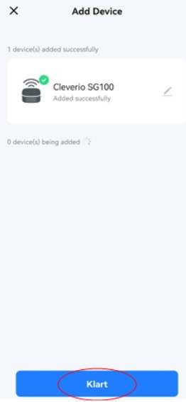

________________________________
Appens Startvy med Cleverio SG100 gateway installerad

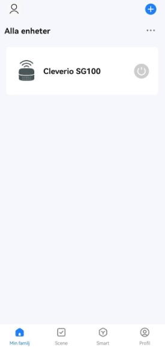

_____________________________________
### Installation av dörrsensor Cleverio SS100

Dörrsensor Cleverio SS100

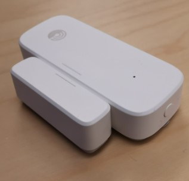

________________________________
Startvyn i appen heter ”Min familj”

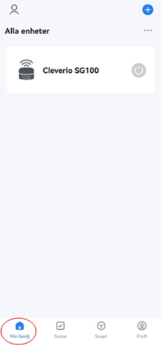

_______________________________
Välj +

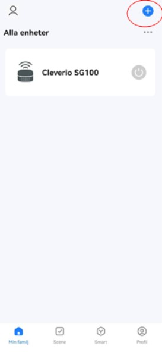

________________________________
Välj Add Device

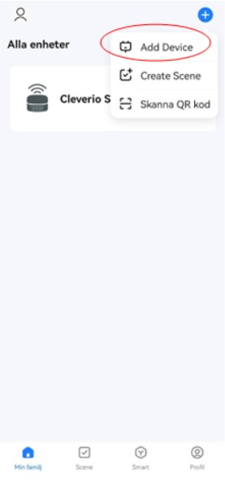

________________________________
Välj först Sensors i fliken till vänster och sedan Sensor (Zigbee) i fliken till höger.

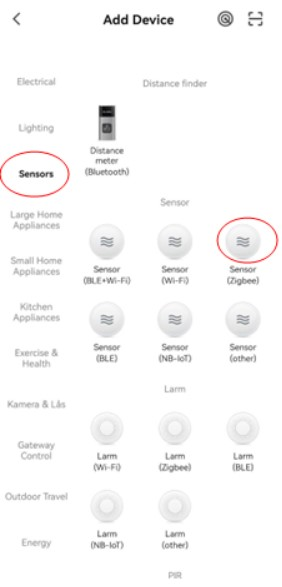

_______________________________
Välj Cleverio SG100

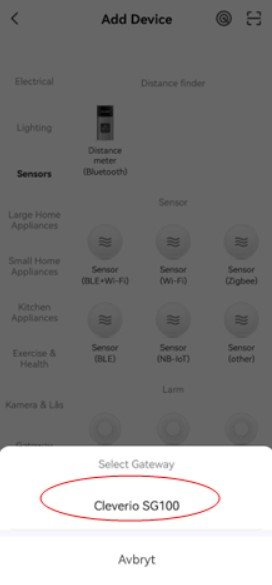

_________________________________
Håll i RESET-knappen i 5 sekunder för att det ska blinka

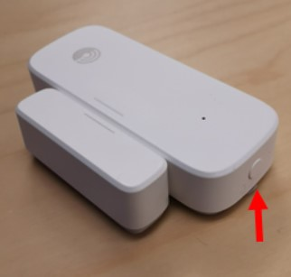

________________________________
Bocka i Comfirm the indicator blinking och tryck på Next.

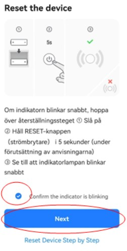

__________________________________
 Välj Klart. Sensorn är nu installerad.

 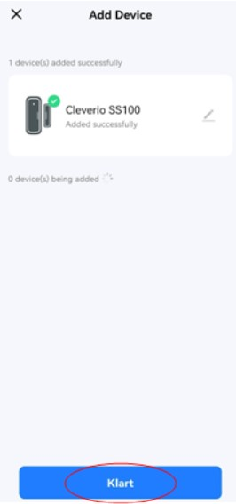

 _________________________________
 Välj bakåtpilen för att komma tillbaka till Startvyn.

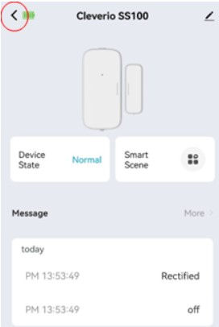

_________________________________
Startvy. Cleverio SS100 installerad.

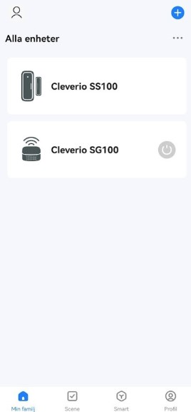

__________________________________

### Installation av Temperatur- och fuktighetsmätare Aqara

Temperatur- och fuktighetsmätare Aqara

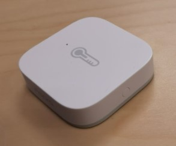

__________________________________
 Börja från appens Startvy och välj +

 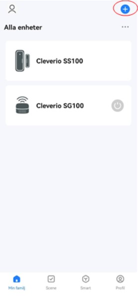

 _________________________________
 Välj Add Device.

 

 __________________________________
 Välj Sensors i fliken till vänster och sedan välj Temperatur och fuktighetsgivare (Zigbee) i fliken till höger. 

__________________________________
Välj Cleverio SG100.

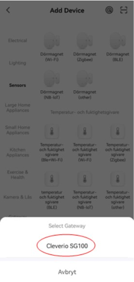

___________________________________
Tryck på RESET-knappen tills det börjar blinka snabbt.

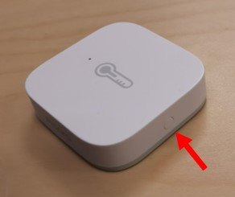

___________________________________
Nu är sensorn hittad. Välj Klart.

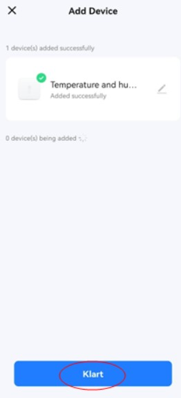

____________________________________
Välj pil bakåt för att gå till Startvyn.

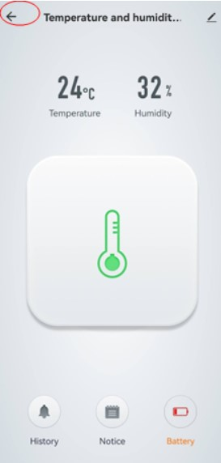

____________________________________
Startvy. Samtliga enheter är nu installerade.

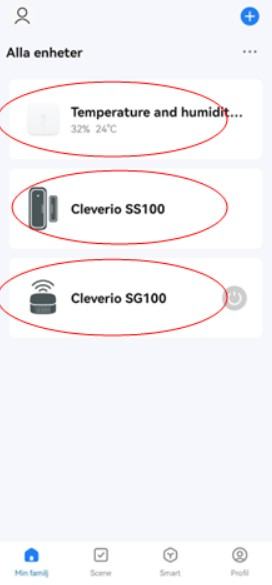

______________________________________

### Exempel på att inställning av funktioner för dörrsensor

Cleverio SS100

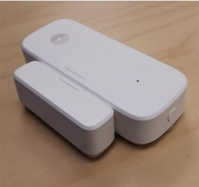

_____________________________________
Välj Scene från Startvyn.

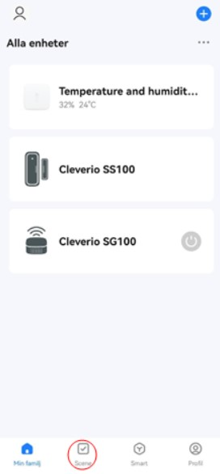

____________________________________
Välj först fliken Tap-to-Run och välj sedan Create scene.

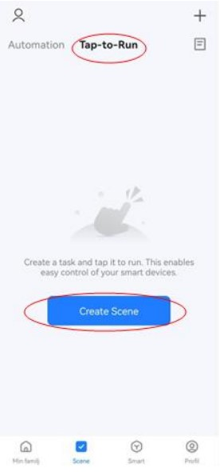

___________________________________
Välj When device status changes

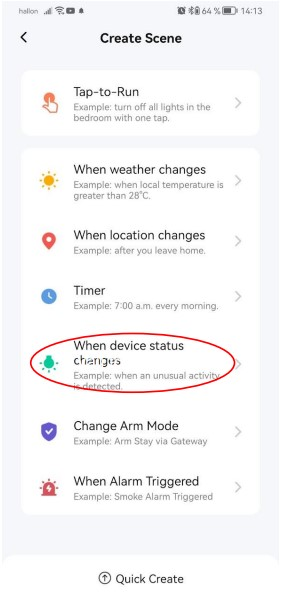

___________________________________
Välj Cleverio SS100.

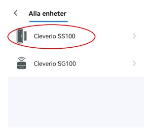

___________________________________
Välj Door and window sensor

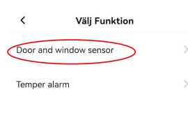

___________________________________
Välj "ON” Varaktighet.

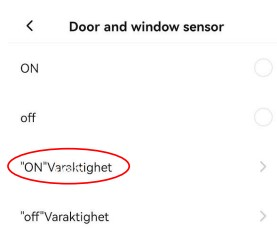

_____________________________________
Justera önskad tid efter hur länge som dörren ska vara öppen innan det larmar. Välj Nästa.

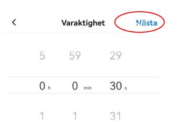

___________________________________
Välj + på Then

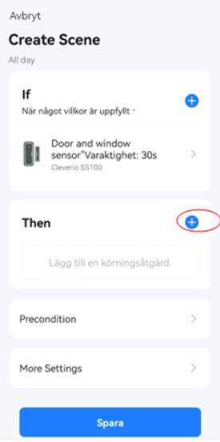

__________________________________
Välj Control Single Device.

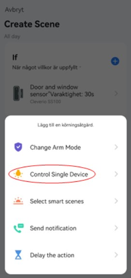

_______________________________
Välj Cleverio SG100.

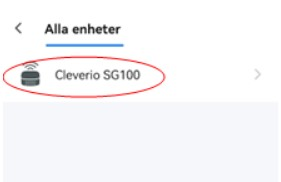

______________________________
Välj Alarm och sedan Spara.

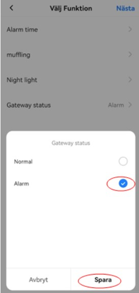

______________________________
Välj Nästa.

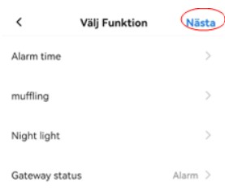

______________________________
Välj + på Then

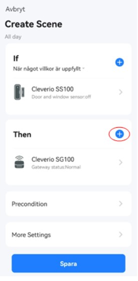

______________________________
Välj Send notification.

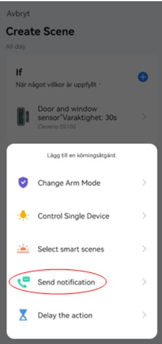

______________________________
Välj message center (gratis meddelande) och sedan välj Nästa.

________________________________
Välj Spara.

__________________________________
Skriv namn på funktionen.

__________________________________
Välj Bekräfta.

_________________________________
Välj Yes.

_________________________________
Funtionen är nu sparad och aktiv vid grönt. Kan avaktiveara den vid behov genom att trycka på grön knapp.

_________________________________
Välj Tap-to-Run. 

____________________________________
Välj Create Scene.

____________________________________--
Välj When device status changes.

____________________________________
Välj Cleverio SS100

___________________________________
Välj Door and window sensor

__________________________________
Välj off.

_________________________________
Välj +

_________________________________
Välj Control Single Device

________________________________
Välj Cleverio SG100

________________________________
Välj Gateway status

_______________________________
Välj Normal och sedan välj Spara

________________________________
 Välj Spara

 

 ________________________________
 Skriv ett namn till funktionen och välj Bekräfta

 

 _______________________________
 Välj Yes

 

 __________________________________
 Funktioner är nu programmerade. Alarm och meddelande går efter att dörren varit öppen mer än 30 sekunder och alarm stängs av när sensorn känner attdörren har stängts.

 

 
 ___________________________________

 ### Exempel på att inställning av funktioner för temperatur- och fuktighetsmätare

 Temperatur- och fuktighetsmätare Aqara

 

 ________________________________________
 Välj Scene från Startsvyn.

 

 _______________________________________
 Välj först fliken Tap-to-Run och välj sedan Create scene.

 

 ______________________________________
 Välj When device status changes.

 

 _____________________________________
 Välj Temperature and humidity sensor.

 

 _____________________________________
 Välj Temperature.

 

 ___________________________________
Justera efter önskemål/behov och välj Nästa.

___________________________________
Välj + på Then

____________________________________
Välj Control Single Device

______________________________________
Välj Cleverio SG100.

____________________________________
Välj Gateway status.

___________________________________
Välj Alarm och Spara.

_________________________________
Välj Nästa.

____________________________________
Välj + på Then

___________________________________
Välj Send notification.

__________________________________
Välj Message Center (den är gratis). Välj sedan Nästa.

___________________________________
Välj Spara.

__________________________________
Skriv namn för funktionen t.ex. “Temperatur över/Alarm på” och sedan välj Bekräfta.

________________________________
Nu är samtliga funktioner installerade. Alarm på när temperaturen överstiger 8 plus grader samt dörr öppen mer än 30 sekunder.
Välj Min familj för att gå tillbaka till Startvy.

