### Installation av appen Smart Life - Smart Living

Ladda ner appen Smart Life - Smart Living från App Store eller Google Play.

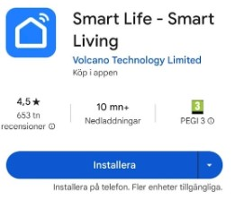

---

Skappa nytt konto

---

Skriv din e-post, godkänn villkoren och sedan välj Get Verification Code

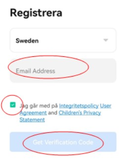

---

Skriv in verifikationskod som du fått i din e-post.

---

Skriv ett lösenord och välj sedan Klart.

---

Välj Go to App.

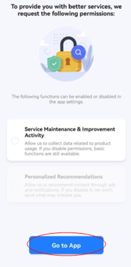

---

Appen är nu installerad.

---

### Installation av Gateway Cleverio SG100

Gateway Cleverio SG100

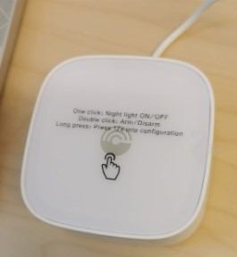

---

Öppna appen och välj Lägg till enhet.

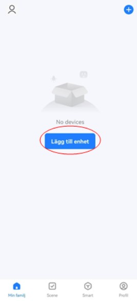

---

Välj Gateway Control I vänstra fliken.

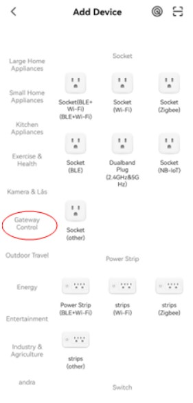

---

Välj Gateway (Zigbee). Samma som på bilden.

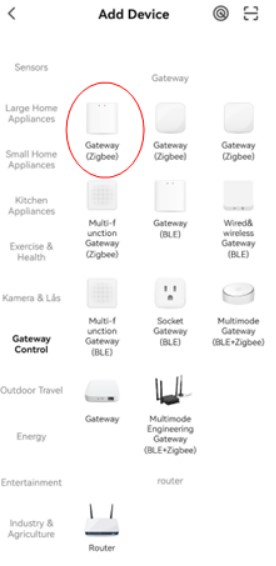

---

Koppla till Wi-Fi (Viktigt att det är 2.4 Ghz. Välj sedan Nästa.

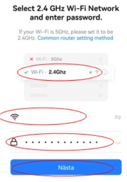

---

Välj Next.

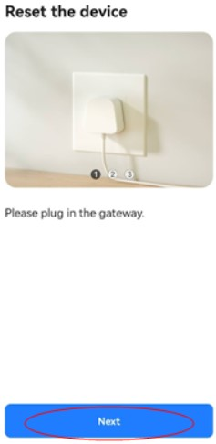

---

Håll RESET 5 sekunder och välj Next.

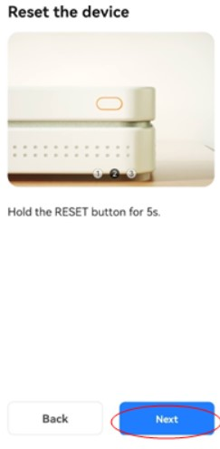
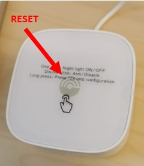

---

Välj Blink Quickly eller Blink Slowly.

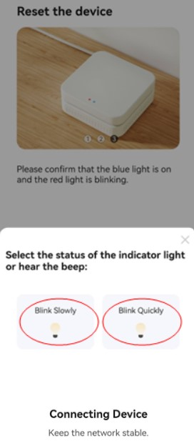

---

Vänta tills enheten hittats.

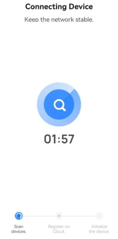

---

Enheten är nu hittad. Välj Klart.

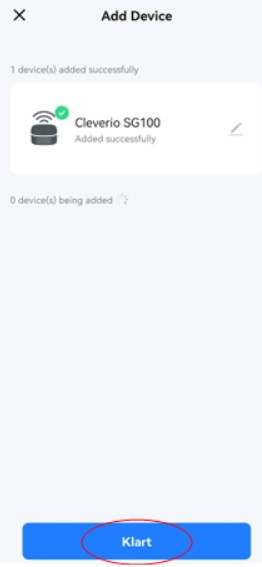

---

Appens Startvy med Cleverio SG100 gateway installerad

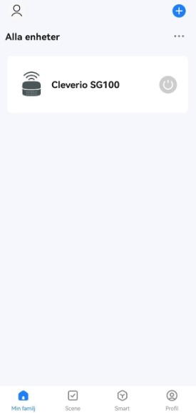

---

### Installation av dörrsensor Cleverio SS100

Dörrsensor Cleverio SS100

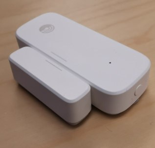

---

Startvyn i appen heter ”Min familj”

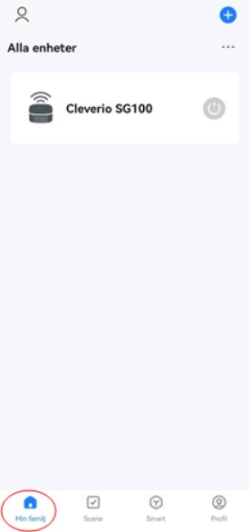

---

Välj +

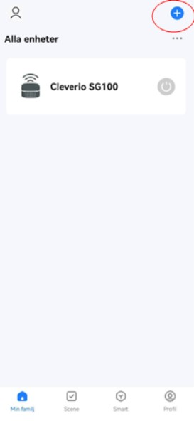

---

Välj Add Device

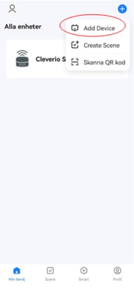

---

Välj först Sensors i fliken till vänster och sedan Sensor (Zigbee) i fliken till höger.

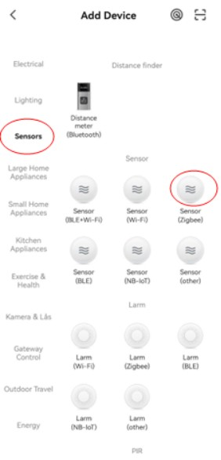

---

Välj Cleverio SG100

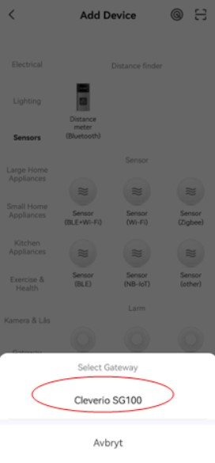

---

Håll i RESET-knappen i 5 sekunder för att det ska blinka

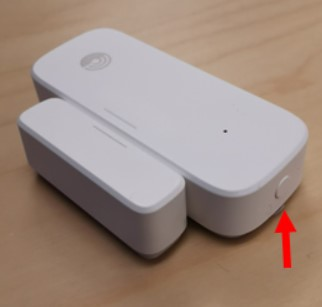

---

Bocka i Comfirm the indicator blinking och tryck på Next.

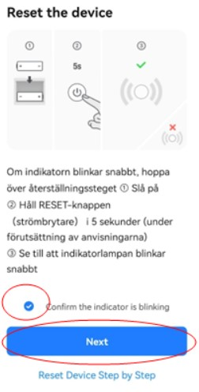

---

Välj Klart. Sensorn är nu installerad.

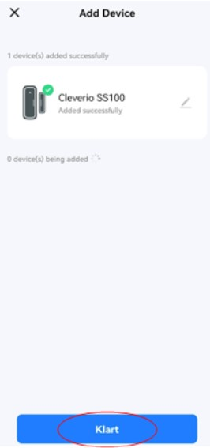

---

Välj bakåtpilen för att komma tillbaka till Startvyn.

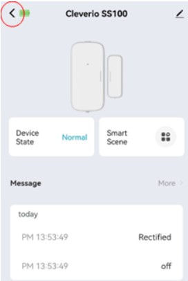

---

Startvy. Cleverio SS100 installerad.

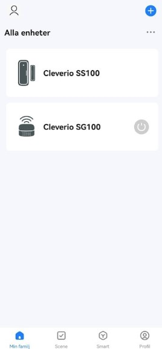

---

### Installation av Temperatur- och fuktighetsmätare Aqara

Temperatur- och fuktighetsmätare Aqara

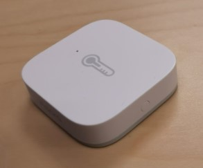

---

Börja från appens Startvy och välj +

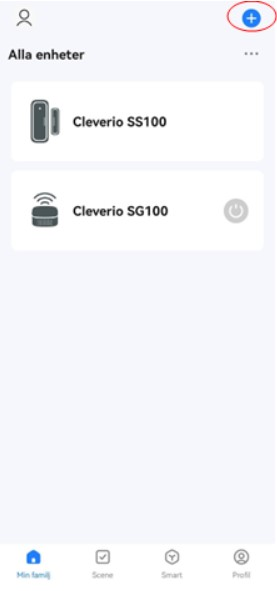

---

Välj Add Device.

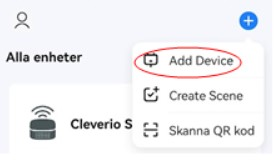

---

Välj Sensors i fliken till vänster och sedan välj Temperatur och fuktighetsgivare (Zigbee) i fliken till höger.

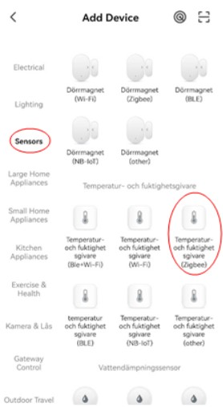

---

Välj Cleverio SG100.

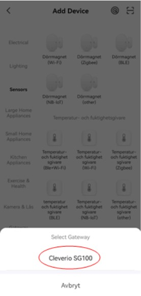

---

Tryck på RESET-knappen tills det börjar blinka snabbt.

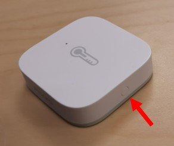

---

Nu är sensorn hittad. Välj Klart.

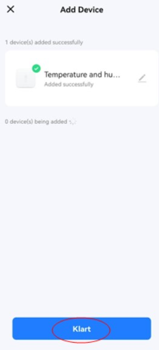

---

Välj pil bakåt för att gå till Startvyn.

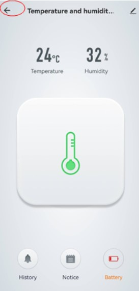

---

Startvy. Samtliga enheter är nu installerade.

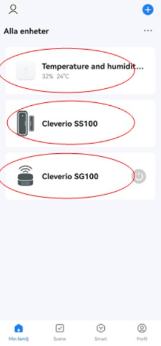

---

### Exempel på att inställning av funktioner för dörrsensor

Cleverio SS100

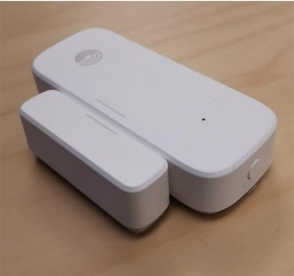

---

Välj Scene från Startvyn.

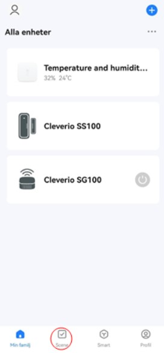

---

Välj först fliken Tap-to-Run och välj sedan Create scene.

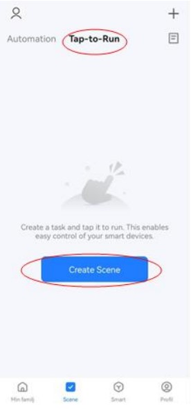

---

Välj When device status changes

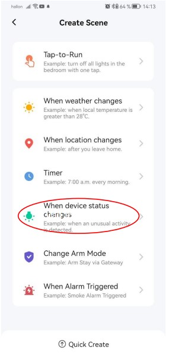

---

Välj Cleverio SS100.

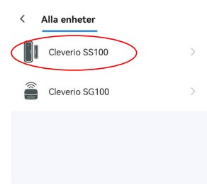

---

Välj Door and window sensor

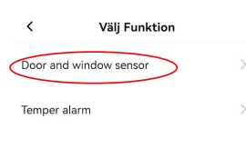

---

Välj "ON” Varaktighet.

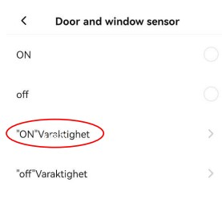

---

Justera önskad tid efter hur länge som dörren ska vara öppen innan det larmar. Välj Nästa.

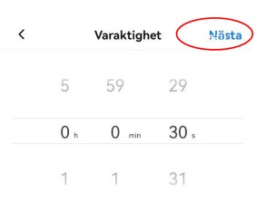

---

Välj + på Then

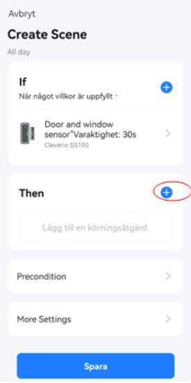

---

Välj Control Single Device.

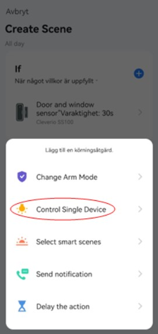

---

Välj Cleverio SG100.

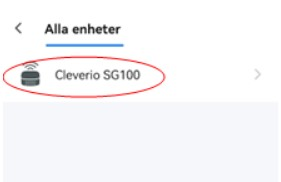

---

Välj Alarm och sedan Spara.

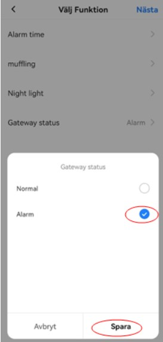

---

Välj Nästa.

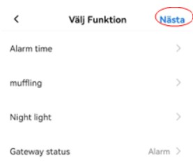

---

Välj + på Then

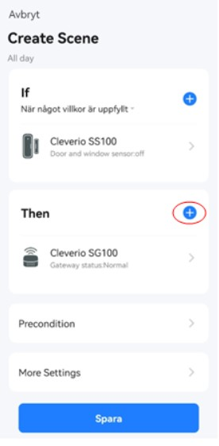

---

Välj Send notification.

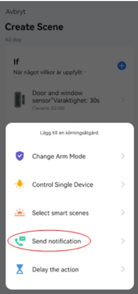

---

Välj message center (gratis meddelande) och sedan välj Nästa.

---

Välj Spara.

---

Skriv namn på funktionen.

---

Välj Bekräfta.

---

Välj Yes.

---

Funtionen är nu sparad och aktiv vid grönt. Kan avaktiveara den vid behov genom att trycka på grön knapp.

---

Välj Tap-to-Run.

---

Välj Create Scene.

**\*\***\*\*\*\***\*\***\_\_\_\_**\*\***\*\*\*\***\*\***--
Välj When device status changes.

---

Välj Cleverio SS100

---

Välj Door and window sensor

---

Välj off.

---

Välj +

---

Välj Control Single Device

---

Välj Cleverio SG100

---

Välj Gateway status

---

Välj Normal och sedan välj Spara

---

Välj Spara

---

Skriv ett namn till funktionen och välj Bekräfta

---

Välj Yes

---

Funktioner är nu programmerade. Alarm och meddelande går efter att dörren varit öppen mer än 30 sekunder och alarm stängs av när sensorn känner attdörren har stängts.

---

### Exempel på att inställning av funktioner för temperatur- och fuktighetsmätare

Temperatur- och fuktighetsmätare Aqara

---

Välj Scene från Startsvyn.

---

Välj först fliken Tap-to-Run och välj sedan Create scene.

---

Välj When device status changes.

---

Välj Temperature and humidity sensor.

---

Välj Temperature.

---

Justera efter önskemål/behov och välj Nästa.

---

Välj + på Then

---

Välj Control Single Device

---

Välj Cleverio SG100.

---

Välj Gateway status.

---

Välj Alarm och Spara.

---

Välj Nästa.

---

Välj + på Then

---

Välj Send notification.

---

Välj Message Center (den är gratis). Välj sedan Nästa.

---

Välj Spara.

---

Skriv namn för funktionen t.ex. “Temperatur över/Alarm på” och sedan välj Bekräfta.

---

Nu är samtliga funktioner installerade. Alarm på när temperaturen överstiger 8 plus grader samt dörr öppen mer än 30 sekunder.
Välj Min familj för att gå tillbaka till Startvy.

